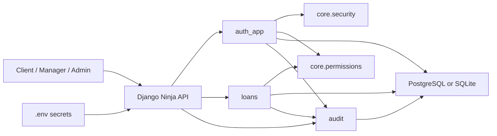
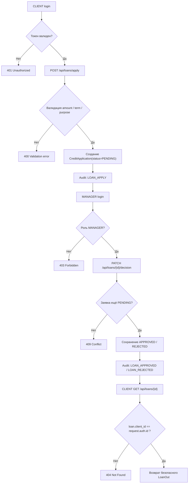

# Практическая работа № 3

Тема: проектирование и реализация минимально жизнеспособного продукта (MVP) и анализ безопасности исходного кода

Вариант: 1. Банковское дело — одобрение кредитов и мониторинг

Выполнил: ____________________

Группа: ____________________

Проверил: ____________________

## Цель работы

Сформировать практические навыки безопасной разработки MVP-системы и проверки безопасности исходного кода с использованием контрольных списков, SAST и SCA.

## Краткое описание MVP

Разработан MVP банковского сервиса подачи заявок на кредит, отслеживания статуса заявки и принятия решения сотрудником банка. Реализация выполнена на Django 5.1.x и Django Ninja API. Система использует ролевую модель `CLIENT`, `MANAGER`, `ADMIN`, базу данных, JWT-аутентификацию, аудит критичных действий, ограничение попыток входа и контроль доступа к конкретным объектам.

Основные API:

1. `POST /api/auth/register`
2. `POST /api/auth/login`
3. `POST /api/auth/refresh`
4. `POST /api/auth/logout`
5. `GET /api/auth/me`
6. `POST /api/loans/apply`
7. `GET /api/loans/`
8. `GET /api/loans/{loan_id}`
9. `PATCH /api/loans/{loan_id}/decision`
10. `GET /api/audit/logs`

Основные сущности:

1. `User`
2. `CreditApplication`
3. `AuditLog`
4. `LoginThrottle`
5. `RevokedToken`

Тестовые данные подготовлены в `seed.py`.
Пароли для тестовых аккаунтов не хранятся в репозитории: они задаются через переменные окружения или генерируются при запуске сидера.

## Результаты задания 1

### 1. Определение области анализа

| Компонент | Назначение | Критичность |
| --- | --- | --- |
| `apps/auth_app/api.py` | Регистрация, вход, refresh, logout, профиль | Высокая |
| `apps/auth_app/models.py` | Пользователи, лимитер входа, denylist токенов | Высокая |
| `apps/loans/api.py` | Подача и обработка кредитных заявок | Высокая |
| `apps/loans/schemas.py` | Валидация суммы, срока, текста назначения и комментария | Высокая |
| `apps/audit/service.py` | Централизованная запись audit-логов и санитизация | Высокая |
| `core/security.py` | Хеширование паролей, JWT, проверка revoked token | Высокая |
| `core/permissions.py` | Bearer auth, ролевой и объектный доступ | Высокая |
| `config/settings.py` | Безопасная конфигурация БД, лимиты загрузки, логирование | Средняя |
| `requirements.txt` | Версии зависимостей для SCA | Высокая |

Внешние зависимости:

1. `django==5.1.15`
2. `django-ninja==1.3.0`
3. `bcrypt==4.2.1`
4. `PyJWT==2.12.0`
5. `psycopg2-binary==2.9.10`
6. `python-dotenv==1.0.1`
7. `pydantic[email]==2.10.4`
8. `bandit==1.7.10`
9. `pip-audit==2.7.3`

Критичные бизнес-сценарии:

1. Клиент регистрируется, входит и подаёт заявку.
2. Клиент просматривает только свои заявки.
3. Менеджер просматривает заявки и принимает решение.
4. Администратор просматривает только журнал аудита.
5. Пользователь обновляет access token по refresh token и завершает сессию через logout.

### 2. Подготовка контекста

Активы:

1. Учетные записи пользователей.
2. Пароли и JWT токены.
3. Заявки на кредит и статусы решений.
4. Журнал критичных действий.
5. Конфигурационные секреты (`SECRET_KEY`, `JWT_SECRET`, параметры БД).

Чувствительные данные:

1. Email пользователя.
2. Хеш пароля.
3. JWT access/refresh token.
4. Решения менеджера по заявкам.
5. IP-адрес и технические детали событий.

Роли:

1. `CLIENT` — регистрация, вход, подача и просмотр только своих заявок.
2. `MANAGER` — просмотр заявок и принятие решения.
3. `ADMIN` — просмотр журнала аудита.

Границы доверия:

1. Клиентский HTTP-запрос → API.
2. API → слой авторизации и валидации.
3. API → база данных.
4. API → модуль audit logging.
5. Конфигурация приложения → переменные окружения.

Вероятные угрозы:

1. Подбор пароля и brute force на `login`.
2. Использование украденного JWT после logout.
3. Просмотр чужой заявки по прямому `loan_id`.
4. Утечка email, токенов или внутренних комментариев через API и логи.
5. SQL injection через поля заявки.
6. Использование уязвимых библиотек.
7. Отказ в обслуживании через крупные запросы.

### 3. Структурная схема MVP

### 4. Блок-схема основного сценария варианта

Ключевой сценарий: клиент подаёт заявку, менеджер принимает решение, клиент видит статус.

### 5. Выделение критичных участков кода

| Участок | Назначение | Код |
| --- | --- | --- |
| Приём логина и ограничение попыток | Защита от brute force и учёт neutral response | `apps/auth_app/api.py:77` |
| Ротация refresh token | Снижение риска replay и повторного использования | `apps/auth_app/api.py:120` |
| Logout и отзыв токенов | Серверное завершение сессии | `apps/auth_app/api.py:146` |
| Модели `LoginThrottle` и `RevokedToken` | Хранение состояния защиты | `apps/auth_app/models.py:27`, `apps/auth_app/models.py:45` |
| Хеширование и JWT | bcrypt, TTL, jti, denylist | `core/security.py:36`, `core/security.py:51`, `core/security.py:64`, `core/security.py:76` |
| Bearer auth и серверная проверка ролей | Проверка полномочий | `core/permissions.py:11`, `core/permissions.py:55`, `core/permissions.py:62` |
| Валидация заявки | Диапазоны и формат пользовательского ввода | `apps/loans/schemas.py:6`, `apps/loans/schemas.py:19` |
| Объектная авторизация по заявке | Доступ только к своей заявке | `apps/loans/api.py:67`, `apps/loans/api.py:116` |
| Санитизация audit-логов | Исключение PII и токенов | `apps/audit/service.py:29`, `apps/audit/service.py:48` |
| Ограничение размера запросов | Защита памяти | `config/settings.py:66` |

### 6. Анализ потоков данных

Ключевой сценарий: `PATCH /api/loans/{loan_id}/decision`

| Этап | Реализация |
| --- | --- |
| Source | `loan_id` из URL, `status` и `comment` из JSON body, `Authorization` header |
| Propagation | `core/permissions.JWTAuth.authenticate()` → `apps/loans/api.make_decision()` |
| Sink | `CreditApplication.save()` и `AuditLog.objects.create()` |
| Sanitization | JWT проверяется в `core/security.decode_token()`, роль проверяется в `get_manager_user()`, `DecisionIn` ограничивает `status` и `comment`, audit details проходят `_sanitize_value()` |

Для сценария подачи заявки:

| Этап | Реализация |
| --- | --- |
| Source | `amount`, `term_months`, `purpose` |
| Propagation | `LoanApplyIn` → `apply_loan()` |
| Sink | `CreditApplication.objects.create()` |
| Sanitization | Pydantic-валидация диапазона, длины, decimal places, запрет HTML-подобного ввода |

### 7. Проверка защитных механизмов

Аутентификация:

1. Пароли хранятся только как bcrypt-хеши: `core/security.py`.
2. Access token имеет ограниченный TTL 30 минут, refresh token — 7 дней.
3. Добавлены `jti` и серверный denylist для logout и rotation refresh token.
4. Добавлен лимитер неудачных входов `LoginThrottle`.

Авторизация:

1. Роли проверяются на сервере в `core/permissions.py`.
2. Объектный доступ к заявке проверяется в `apps/loans/api.py:116`.
3. Audit logs доступны только администратору.

Валидация:

1. Email нормализуется и валидируется.
2. Пароль ограничен по длине и сложности.
3. Сумма кредита, срок и текстовые поля валидируются.
4. Размеры запросов ограничены в конфигурации.

Журналирование и ошибки:

1. Журналируются регистрация, вход, ошибки входа, подача заявки, решение по заявке, logout, refresh.
2. Логи проходят санитизацию, ключи `email`, `password`, `token`, `secret` редактируются.
3. Сообщения об ошибках нейтральны: `Invalid credentials`, `Application not found`.

Криптография и секреты:

1. Используется `bcrypt`.
2. Используется JWT HS256 с секретом из `.env`.
3. Захардкоженные секреты отсутствуют.

### 8. Таблица находок и рекомендаций

| № | Файл / модуль | Фрагмент / строка | Тип уязвимости | Риск | Последствие | Критичность | Исправление | Статус |
| --- | --- | --- | --- | --- | --- | --- | --- | --- |
| 1 | `apps/auth_app/api.py` | `login`, до исправления | Отсутствие rate limit | Brute force логина | Компрометация учетной записи | Высокая | Добавлен `LoginThrottle`, блокировка после 5 ошибок за 15 минут | Исправлено |
| 2 | `apps/auth_app/api.py`, `core/security.py` | `logout` / `decode_token`, до исправления | Отсутствие отзыва JWT | Повторное использование украденного токена после logout | Несанкционированный доступ | Высокая | Добавлены `jti`, `RevokedToken`, logout, refresh rotation | Исправлено |
| 3 | `apps/audit/service.py` | audit details, до исправления | Утечка чувствительных данных в лог | Попадание email и токенов в аудит | Нарушение конфиденциальности | Высокая | Добавлена `_sanitize_value()` и редактирование чувствительных ключей | Исправлено |
| 4 | `apps/loans/schemas.py`, `apps/loans/api.py` | ввод заявки и комментария | Некорректная валидация ввода | Инъекции и мусорные данные | Ошибки хранения и обработки | Высокая | Жёсткая Pydantic-валидация типа, длины, диапазона и формата | Исправлено |
| 5 | `apps/loans/api.py` | `get_loan`, `_assert_can_view` | Broken Object Level Authorization | Просмотр чужой заявки | Утечка бизнес-данных | Высокая | Серверная проверка владельца объекта и возврат `404` вместо `403` | Исправлено |
| 6 | `apps/loans/schemas.py` | `LoanOut`, до исправления | Избыточные поля API | Выдача внутренних данных клиента/менеджера | Утечка внутренних атрибутов | Средняя | Возврат только безопасного набора полей | Исправлено |
| 7 | `config/settings.py` | зависимости, до исправления | Уязвимые библиотеки | Известные CVE в Django и PyJWT | Компрометация приложения | Высокая | Обновлены зависимости до `django==5.1.15`, `PyJWT==2.12.0` | Исправлено |
| 8 | `config/settings.py` | конфигурация БД | Риск неработающих тестов и dev-среды | Неповторяемость анализа | Ошибки верификации | Средняя | Добавлен безопасный fallback на SQLite для тестов и локальной демонстрации | Исправлено |

### 9. Рекомендации

Рекомендации, применённые в коде:

1. Использовать только ORM и параметризованные запросы.
2. Хранить секреты только в `.env`, не коммитить `.env` в репозиторий.
3. Ограничивать права ролей на сервере, а не только в интерфейсе.
4. Проверять доступ не только по факту входа, но и к конкретному объекту.
5. Не включать email, токены, пароли и секреты в логи.
6. Поддерживать короткий срок жизни access token и rotation refresh token.
7. Ограничивать количество неудачных входов.
8. Поддерживать зависимости в актуальном патч-уровне и повторять `pip-audit`.
9. Для production использовать отдельного пользователя БД без прав superuser.

## Результаты задания 2

### 1. Контрольный список: входные данные

| Проверка | Результат | Подтверждение |
| --- | --- | --- |
| Наличие обязательных полей | Выполнено | `apps/auth_app/schemas.py`, `apps/loans/schemas.py` |
| Типы данных | Выполнено | `EmailStr`, `Decimal`, `int`, `str` |
| Формат | Выполнено | Регулярное выражение пароля, pattern для `status` |
| Диапазон | Выполнено | `amount <= 50000000`, `term_months <= 360` |
| Длина | Выполнено | `full_name <= 200`, `purpose <= 500`, `comment <= 1000` |
| Допустимые значения | Выполнено | `APPROVED` / `REJECTED`, роли и статусы ограничены choices |

### 2. Контрольный список: аутентификация

| Проверка | Результат | Подтверждение |
| --- | --- | --- |
| Пароли хранятся как хеш | Выполнено | bcrypt в `core/security.py` |
| Access token защищён | Выполнено | TTL 30 минут, проверка revoke |
| Refresh token защищён | Выполнено | TTL 7 дней, `jti`, rotation, revoke |
| Срок жизни сессии ограничен | Выполнено | `ACCESS_TOKEN_TTL`, `REFRESH_TOKEN_TTL` |
| Logout реализован | Выполнено | `apps/auth_app/api.py:146` |
| Ограничение попыток входа | Выполнено | `apps/auth_app/models.py:27`, `apps/auth_app/services.py` |

### 3. Контрольный список: авторизация

| Проверка | Результат | Подтверждение |
| --- | --- | --- |
| Права проверяются на сервере | Выполнено | `core/permissions.py` |
| Доступ к конкретному объекту | Выполнено | `apps/loans/api.py:116` |
| Административные функции изолированы | Выполнено | `apps/audit/api.py:19` |
| Защита от повышения привилегий | Выполнено | Роль клиента принудительно назначается при регистрации |

### 4. Контрольный список: данные и логирование

| Проверка | Результат | Подтверждение |
| --- | --- | --- |
| Нет лишних полей в API | Выполнено | `apps/loans/schemas.py:31` |
| Пароли и токены не пишутся в лог | Выполнено | `apps/audit/service.py:29` |
| Сообщения об ошибках нейтральны | Выполнено | `Invalid credentials`, `Application not found` |
| Есть аудит критичных действий | Выполнено | `apps/audit/service.py:48` |

### 5. Контрольный список: криптография

| Проверка | Результат | Подтверждение |
| --- | --- | --- |
| Современный алгоритм хеширования | Выполнено | bcrypt |
| Нет самописной криптографии | Выполнено | Используются стандартные библиотеки |
| Нет захардкоженных секретов | Выполнено | `.env`, `.env.example` |

### 6. Контрольный список: зависимости и окружение

| Проверка | Результат | Подтверждение |
| --- | --- | --- |
| Версии библиотек зафиксированы | Выполнено | `requirements.txt` |
| Выполнен SAST | Выполнено | `reports/bandit.txt` |
| Выполнен SCA | Выполнено | `reports/pip-audit.txt` |
| Пароли не хранятся в репозитории | Выполнено | `.env` в `.gitignore`, используется `.env.example` |
| Критические/высокие CVE устранены | Выполнено | После обновления зависимостей `pip-audit` возвращает `No known vulnerabilities found` |

## Фрагменты кода, подтверждающие защитные механизмы

1. Валидация входных данных: `apps/auth_app/schemas.py:10`, `apps/loans/schemas.py:6`
2. JWT + revoke: `core/security.py:51`, `core/security.py:64`, `core/security.py:76`
3. Logout и rotation: `apps/auth_app/api.py:120`, `apps/auth_app/api.py:146`
4. Rate limit: `apps/auth_app/models.py:27`, `apps/auth_app/services.py`
5. Объектная авторизация: `apps/loans/api.py:116`
6. Санитизация логов: `apps/audit/service.py:29`
7. Ограничения памяти: `config/settings.py:66`

## Результаты SAST и SCA

### SAST (`bandit`)

Дата запуска: 2026-04-11

Результат: `No issues identified`

Полный вывод: `reports/bandit.txt`

### SCA (`pip-audit`)

Дата запуска: 2026-04-11

Промежуточный результат до обновления зависимостей:

1. `django==5.1.4` — обнаружено 12 уязвимостей.
2. `PyJWT==2.10.1` — обнаружена 1 уязвимость.

Действия:

1. `django` обновлён до `5.1.15`.
2. `PyJWT` обновлён до `2.12.0`.

Финальный результат: `No known vulnerabilities found`

Полный вывод: `reports/pip-audit.txt`

### Автотесты

Дата запуска: 2026-04-11

Результат: `Ran 8 tests ... OK`

Покрытые сценарии:

1. Refresh rotation invalidates old refresh token.
2. Logout отзывает access и refresh token.
3. Failed login attempts are rate limited.
4. Клиент не видит чужую заявку.
5. Менеджер принимает решение без утечки внутренних полей.
6. Администратор не может просматривать и изменять кредитные заявки менеджера.
7. Audit log redacts sensitive details.
8. Audit endpoint доступен только администратору.

Полный вывод: `reports/test-results.txt`

## Таблица рисков, предотвращённых в MVP

| Риск | Механизм |
| --- | --- |
| SQL injection | Django ORM, отсутствие конкатенации SQL |
| Brute force login | `LoginThrottle` |
| Replay / reuse JWT после logout | `RevokedToken`, `jti`, logout, refresh rotation |
| Broken Object Level Authorization | `_assert_can_view()` |
| Избыточная выдача внутренних полей | Безопасный `LoanOut` |
| Утечка email, токенов, секретов в лог | `_sanitize_value()` |
| DoS крупными запросами | `DATA_UPLOAD_MAX_MEMORY_SIZE`, `DATA_UPLOAD_MAX_NUMBER_FIELDS` |
| Уязвимые зависимости | `pip-audit` и обновление версий |

## Выводы по работе

В ходе практической работы разработан защищённый MVP сервиса кредитных заявок с полноценным основным бизнес-сценарием: клиент может зарегистрироваться, авторизоваться, подать заявку и проверить её статус; менеджер может принять решение; администратор может просматривать журнал аудита.

В процессе анализа были выявлены и устранены типовые проблемы безопасности: отсутствие logout и отзыва токенов, отсутствие ограничения попыток входа, риск утечки чувствительных данных через audit-лог, избыточные поля в API и уязвимые версии зависимостей. После исправлений проект проходит автотесты, `bandit` и `pip-audit`, что подтверждает выполнение обязательных требований к безопасной разработке MVP.
