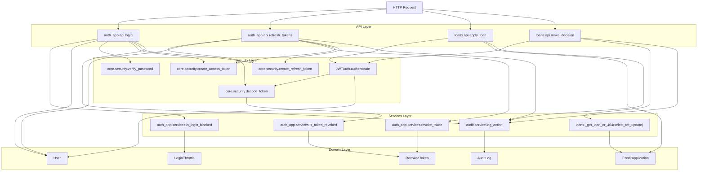

# Практическая работа №4

**Тема:** Статический анализ MVP и автоматическое выявление потенциальных уязвимостей
**Проект:** `mvp_bank` (Django + Django Ninja)

## Цель работы

Провести ручной и автоматический статический анализ текущего MVP, выявить риски безопасности, исправить критичные проблемы и сравнить результаты до/после исправлений.

## Задание 1. Ручной статический анализ MVP

### 1.1 Анализ структуры программы


| Функция / модуль                         | Назначение                                                | Тип в модели Source → Propagation → Sink | Путь и строки          |
| ----------------------------------------------------- | ------------------------------------------------------------------- | ---------------------------------------------------- | --------------------------------- |
| `apps/auth_app/api.py::login()`                       | Вход пользователя, выдача JWT                 | Source + Sink                                        | `apps/auth_app/api.py:100-139`    |
| `apps/auth_app/api.py::refresh_tokens()`              | Ротация refresh/access токенов                        | Source + Propagation + Sink                          | `apps/auth_app/api.py:153-177`    |
| `apps/auth_app/services.py::register_login_failure()` | Лимитирование неуспешных логинов      | Propagation                                          | `apps/auth_app/services.py:64-89` |
| `core/security.py::decode_token()`                    | Верификация JWT                                          | Propagation                                          | `core/security.py:82-109`         |
| `apps/loans/api.py::apply_loan()`                     | Подача заявки на кредит                         | Source + Sink                                        | `apps/loans/api.py:39-61`         |
| `apps/loans/api.py::make_decision()`                  | Изменение статуса заявки менеджером | Source + Sink                                        | `apps/loans/api.py:125-151`       |
| `apps/audit/service.py::log_action()`                 | Запись событий в журнал                         | Sink                                                 | `apps/audit/service.py:48-72`     |
| `core/network.py::get_client_ip()`                    | Определение IP клиента                            | Propagation                                          | `core/network.py:35-48`           |

### 1.2 Граф вызовов (визуализация)




**Трассировка слоёв графа к коду**

1. `Layer 0: Entry / routing`
   `config/urls.py:1-50` — создание `NinjaAPI`, подключение роутеров и вход через `path("api/", api.urls)`.
2. `Layer 1: Endpoint routers`
   `apps/auth_app/api.py:51-226`, `apps/loans/api.py:29-176`, `apps/audit/api.py:19-42`.
3. `Layer 2: Validation / serialization`
   `apps/auth_app/schemas.py:10-138`, `apps/loans/schemas.py:6-73`, `apps/audit/schemas.py:6-32`, а также `Query(...)` в `apps/loans/api.py:74-78` и `apps/audit/api.py:29-33`.
4. `Layer 2: Authentication / authorization context`
   `core/permissions.py:11-69`, `core/network.py:35-48`, `apps/loans/api.py:166-176`.
5. `Layer 3: Security / service logic`
   `core/security.py:22-109`, `apps/auth_app/services.py:18-133`, `apps/audit/service.py:29-72`, `apps/loans/api.py:156-163`.
6. `Layer 3: Transaction boundaries`
   `apps/auth_app/api.py:164-169`, `apps/loans/api.py:128-137`, `apps/auth_app/services.py:64-89`.
7. `Layer 4: Persistence models`
   `apps/auth_app/models.py:12-67`, `apps/loans/models.py:5-38`, `apps/audit/models.py:5-25`.
8. `Layer 5: Runtime configuration / storage`
   `config/settings.py:18-121` — security flags, proxy trust, middleware, DB backend selection.

### 1.3 Анализ потоков данных (SQLi / Command Injection / Path Traversal / XSS)

1. **SQL Injection**
   Source: поля `email`, `amount`, `purpose`, `comment` из HTTP-запросов.
   Propagation: схемы `pydantic` + ORM-фильтры/создание.
   Sink: `User.objects.filter/create`, `CreditApplication.objects.create/get`.
   Вывод: прямого SQL-конкатенирования нет, риск SQLi в текущем коде низкий.
2. **Command Injection**
   Source: пользовательский ввод API.
   Sink: вызовы ОС (`subprocess/os.system`) в runtime-коде отсутствуют.
   Вывод: прямого sink нет, но риск возникнет при добавлении shell-команд без безопасной обвязки.
3. **Path Traversal**
   Source: пользовательские пути файлов в API отсутствуют.
   Sink: операции `open()/FileResponse` по пользовательскому пути отсутствуют.
   Вывод: прямой path traversal в текущем MVP не выявлен.
4. **XSS**
   Source: `purpose`, `comment`, `full_name`.
   Propagation: данные сохраняются в БД и могут возвращаться клиентам в JSON.
   Sink: потенциальный фронтенд-рендер без экранирования.
   Вывод: сервер дополнительно режет HTML-подобный ввод (`<`/`>`), что снижает риск stored XSS.

**Кодовая трассировка сущностей и фрагментов**

1. Схемы пользовательского ввода: `apps/auth_app/schemas.py:10-83` (`email`, `password`, `full_name`, `refresh_token`), `apps/loans/schemas.py:6-49` (`amount`, `purpose`, `comment`, `status`).
2. SQL sink через ORM: `apps/auth_app/api.py:66-75`, `apps/auth_app/api.py:115-116`, `apps/auth_app/api.py:160-160`, `apps/loans/api.py:45-50`, `apps/loans/api.py:85-91`, `apps/loans/api.py:110-110`, `apps/loans/api.py:128-137`, `apps/loans/api.py:156-161`.
3. Анти-XSS валидация полей: `apps/auth_app/schemas.py:30-35`, `apps/loans/schemas.py:11-16`, `apps/loans/schemas.py:34-39`.
4. Аудит как sink: `apps/audit/service.py:48-72`.

### 1.4 Анализ зависимостей управления

Проверено, выполняются ли критические действия только под корректными условиями:

1. Проверка ролей перед `make_decision` и `audit/logs` есть: `core/permissions.py:59-69`, `apps/loans/api.py:125-137`, `apps/audit/api.py:29-42`.
2. Перед refresh/logout есть проверка структуры и типа токена: `apps/auth_app/api.py:155-167`, `apps/auth_app/api.py:198-205`, `core/security.py:82-109`.
3. Исправленная атомарность чувствительных операций реализована в `apps/auth_app/api.py:164-169` и `apps/loans/api.py:128-137`.
4. После исправлений критические ветки заключены в транзакции и блокировки строк: `apps/auth_app/services.py:105-133`, `apps/loans/api.py:156-160`.

### 1.5 Анализ модульных и библиотечных зависимостей

Критичные по безопасности узлы:

1. `core/security.py` — JWT и пароли (`core/security.py:22-109`).
2. `apps/auth_app/services.py` — анти-bruteforce и denylist токенов (`apps/auth_app/services.py:18-133`).
3. `apps/loans/api.py` — бизнес-критичные решения по заявкам (`apps/loans/api.py:39-176`).
4. `config/settings.py` — режим безопасности рантайма (`config/settings.py:18-121`).
5. Зависимости: `django`, `PyJWT`, `bcrypt`, `django-ninja`, `psycopg2-binary` (`requirements.txt:1-5`).

### 1.6 Выявленные потенциальные уязвимости (не менее 8)


| № | Файл / строки                                                                                    | Тип проблемы                                                   | Source            | Sink                                     | Последствие                                       | Критичность | Статус         |
| -- | ---------------------------------------------------------------------------------------------------------- | ------------------------------------------------------------------------- | ----------------- | ---------------------------------------- | ------------------------------------------------------------ | ---------------------- | -------------------- |
| 1  | `core/network.py:35-48`; `apps/auth_app/api.py:103-110,171-175,207-210`; `apps/loans/api.py:57-58,144-145` | Доверие к spoofed`X-Forwarded-For`                                | HTTP header       | Логи/лимитер                  | Обход лимитов, подмена IP в аудите | Высокая         | Исправлено |
| 2  | `apps/auth_app/services.py:18-32,64-94`; `apps/auth_app/api.py:105-128`                                    | Brute-force bypass через распределённые IP             | login input       | throttle lookup                          | Подбор пароля с ротацией IP             | Высокая         | Исправлено |
| 3  | `apps/auth_app/api.py:153-177`; `apps/auth_app/services.py:105-133`                                        | Refresh replay race                                                       | refresh token     | выдача новых токенов   | Повторная эмиссия токенов             | Критическая | Исправлено |
| 4  | `apps/loans/api.py:125-151,156-163`                                                                        | Race condition при принятии решения                     | decision request  | запись статуса заявки | Неконсистентные решения                | Высокая         | Исправлено |
| 5  | `apps/loans/api.py:74-91`                                                                                  | Отсутствие пагинации                                   | list request      | возврат полного queryset   | Memory/DoS риск                                          | Высокая         | Исправлено |
| 6  | `core/security.py:82-109`                                                                                  | Неполная валидация claims JWT                            | token payload     | auth context                             | Token confusion при reuse секрета                  | Высокая         | Исправлено |
| 7  | `config/settings.py:37-42,98-121`                                                                          | Неполные prod-security настройки                         | deployment config | HTTP transport                           | MitM/clickjacking/CSRF-риски                            | Высокая         | Исправлено |
| 8  | `setup_db.sql:8-15`                                                                                        | Hardcoded пароль в инфраструктурном скрипте | repo content      | DB credential creation                   | Утечка учётных данных БД                | Высокая         | Исправлено |

### 1.7 Статистический анализ ручной проверки

#### Распределение по типам


| Тип проблемы                                                                | Количество | Доля |
| -------------------------------------------------------------------------------------- | -------------------- | -------- |
| Аутентификация / токены                                            | 3                    | 37.5%    |
| Контроль доступа / целостность бизнес-операций | 2                    | 25.0%    |
| Конфигурация и инфраструктура                               | 2                    | 25.0%    |
| Доступность (DoS)                                                           | 1                    | 12.5%    |

#### Распределение по критичности


| Критичность | Количество |
| ---------------------- | -------------------- |
| Критическая | 1                    |
| Высокая         | 7                    |
| Средняя         | 0                    |
| Низкая           | 0                    |

Вывод: наибольший риск был связан с токенами/аутентификацией и транзакционной целостностью критичных операций.

---

## Задание 2. Автоматическое выявление проблем

### 2.1 Инструменты и команды

Использованы:

1. `bandit` — SAST для Python-кода.
2. `pip-audit` — SCA для Python-зависимостей.
3. `python manage.py check --deploy` — security-check конфигурации Django.

Команды:

```bash
./.tools/bin/bandit.exe -r apps core config -x "*/tests.py" -q
./.tools/bin/pip-audit.exe -r requirements.txt --no-deps --progress-spinner off
./.venv/Scripts/python.exe manage.py check --deploy
```

### 2.2 Автоматический анализ текущего MVP

Итог запуска:

1. `bandit`: 0 проблем (`reports/bandit.txt`).
2. `pip-audit`: 0 известных CVE среди прямых pinned-зависимостей из `requirements.txt` (запуск с `--no-deps`, `reports/pip-audit.txt`).
3. `django check --deploy`: 0 предупреждений (`reports/django-check-deploy.txt`).

### 2.3 Все внесённые исправления и доработки

Ниже собраны все фактические исправления, внесённые в код и отчёт. `Fix 1-8` относятся к коду и конфигурации проекта, `Fix 9-11` — к корректности воспроизведения и качеству документации.

#### Fix 1: Refresh replay race

Код: `apps/auth_app/api.py:153-177`, `apps/auth_app/services.py:105-133`, `core/security.py:53-79`.

```python
# Было (уязвимо к race):
# revoke_token(payload=payload, user=user, reason="refresh_rotated")
# access = create_access_token(...)
# refresh = create_refresh_token(...)

# Стало:
with transaction.atomic():
    if not revoke_token(payload=payload, user=user, reason="refresh_rotated"):
        raise HttpError(401, "Invalid token")
    access = create_access_token(user.pk, user.role)
    refresh = create_refresh_token(user.pk)
```

#### Fix 2: Rate limit bypass

Код: `apps/auth_app/services.py:18-32`, `apps/auth_app/services.py:64-94`, `apps/auth_app/api.py:105-128`.

```python
# Было: только один scope email|ip
# _scope_key(email, ip)

# Стало: двойной scope (email + email|ip)
return [
    (f"email:{normalized_email}", None),
    (f"email_ip:{normalized_email}|{ip_address or 'unknown'}", ip_address),
]
```

#### Fix 3: Loan decision race

Код: `apps/loans/api.py:125-151`, `apps/loans/api.py:156-163`.

```python
# Было: чтение + запись без блокировки строки
# loan = _get_loan_or_404(loan_id)

# Стало: транзакция + select_for_update
with transaction.atomic():
    loan = _get_loan_or_404(loan_id, for_update=True)
    ...
```

#### Fix 4: Spoofed client IP

Код: `core/network.py:22-48`, `config/settings.py:27,103-106`, `apps/auth_app/api.py:103-110`, `apps/loans/api.py:52-58,139-145`.

```python
# Было: безусловное доверие X-Forwarded-For
# forwarded = request.META.get("HTTP_X_FORWARDED_FOR")

# Стало: доверие proxy-заголовкам только при включённом флаге
if getattr(settings, "TRUST_PROXY_HEADERS", False):
    forwarded_ip = _extract_forwarded_ip(...)
```

#### Fix 5: Неполная JWT валидация

Код: `core/security.py:82-109`.

```python
# Было: jwt.decode(token, secret, algorithms=["HS256"])

# Стало:
jwt.decode(
    token,
    _jwt_secret(),
    algorithms=["HS256"],
    audience=JWT_AUDIENCE,
    issuer=JWT_ISSUER,
    options={"require": ["sub", "iss", "aud", "iat", "exp", "type", "jti"]},
)
```

#### Fix 6: Пагинация списка заявок

Код: `apps/loans/api.py:74-91`.

```python
def list_loans(
    request: HttpRequest,
    page: int = Query(default=1, ge=1),
    page_size: int = Query(default=50, ge=1, le=100),
):
    offset = (page - 1) * page_size
    return list(qs[offset : offset + page_size])
```

#### Fix 7: Усиление security-конфигурации Django

Код: `config/settings.py:37-42`, `config/settings.py:98-121`.

```python
MIDDLEWARE = [
    "django.middleware.security.SecurityMiddleware",
    "django.middleware.common.CommonMiddleware",
    "django.middleware.csrf.CsrfViewMiddleware",
    "django.middleware.clickjacking.XFrameOptionsMiddleware",
]

SECURE_CONTENT_TYPE_NOSNIFF = True
X_FRAME_OPTIONS = "DENY"
SECURE_REFERRER_POLICY = "same-origin"
```

Дополнительно для production-режима включены `SESSION_COOKIE_SECURE`, `CSRF_COOKIE_SECURE`, `SECURE_SSL_REDIRECT`, `SECURE_HSTS_SECONDS`, `SECURE_HSTS_INCLUDE_SUBDOMAINS`, `SECURE_HSTS_PRELOAD`.

#### Fix 8: Удалён небезопасный пароль по умолчанию в SQL-скрипте

Код: `setup_db.sql:10-15`.

```sql
\if :{?app_password}
\else
    \echo 'ERROR: app_password variable is required. Example: psql -U postgres -v app_password=StrongRandomPasswordHere -f setup_db.sql'
    \quit 1
\endif
```

#### Fix 9: Команды в отчёте приведены к Windows / Git Bash среде

Источники: `AGENTS.md:1-6`, `reports/bandit.txt:1-4`, `reports/pip-audit.txt:1-4`, `reports/django-check-deploy.txt:1`.

```bash
./.tools/bin/bandit.exe -r apps core config -x "*/tests.py" -q
./.tools/bin/pip-audit.exe -r requirements.txt --no-deps --progress-spinner off
./.venv/Scripts/python.exe manage.py check --deploy
```

Исправление устраняет расхождение между документированной средой Windows/Git Bash и прежними Linux-style путями вида `.venv/bin/...`.

#### Fix 10: Уточнено фактическое покрытие `pip-audit`

Источники: `reports/pip-audit-before-fix.txt:1-2`, `reports/pip-audit.txt:1-4`, `requirements.txt:1-9`.

```text
До: 13 уязвимостей в прямых зависимостях (`django`:12, `PyJWT`:1)
После: 0 известных CVE среди прямых pinned-зависимостей из requirements.txt
Ограничение: запуск выполнен с --no-deps
```

Исправление убирает завышение результата: теперь отчёт явно фиксирует, что аудит относится к прямым pinned-зависимостям, а не ко всему дереву пакетов.

#### Fix 11: Граф вызовов переработан по слоям и сделан Mermaid-safe

Источники: `config/urls.py:1-50`, `core/permissions.py:11-69`, `core/security.py:22-109`, `apps/auth_app/services.py:18-133`, `apps/auth_app/api.py:51-226`, `apps/loans/api.py:29-176`, `apps/audit/api.py:19-42`, `apps/audit/service.py:29-72`, `apps/auth_app/models.py:12-67`, `apps/loans/models.py:5-38`, `apps/audit/models.py:5-25`.

Ключевые доработки графа:

1. Добавлены слои `Entry / routing`, `Endpoint routers`, `Validation / auth`, `Security / services`, `Persistence`, `Runtime config`.
2. Узлы теперь связаны не только по endpoint-функциям, но и по сериализации, permission-checks, транзакциям, ORM-моделям и БД.
3. Подписи Mermaid-узлов с пунктуацией и скобками оформлены безопасно, чтобы избежать parser error на строках вроде `loans._get_loan_or_404(select_for_update)`.

### 2.4 Сравнение результатов до/после


| Инструмент                                  | До исправлений                                                                 | После исправлений                                 | Снижение |
| ----------------------------------------------------- | ------------------------------------------------------------------------------------------- | ----------------------------------------------------------------- | ---------------- |
| `pip-audit` (по `reports/pip-audit-before-fix.txt`) | 13 уязвимостей в прямых зависимостях (`django`:12, `PyJWT`:1) | 0 уязвимостей в прямых зависимостях | 100%             |
| `django check --deploy`                               | 3 security warning                                                                          | 0                                                                 | 100%             |
| `bandit` (целевой runtime-код)              | 0 high/medium                                                                               | 0 high/medium                                                     | 0%               |

---

## Выводы

1. Наиболее полезными в проекте оказались: `pip-audit` (проверка прямых pinned-зависимостей), `check --deploy` (конфигурация), `bandit` (быстрый SAST-контроль).
2. Автоинструменты не покрывают все логические риски (например, race-condition в бизнес-операциях); такие дефекты выявлены именно ручным анализом.
3. После исправлений закрыты критичные векторы по refresh replay, brute-force bypass, spoofed IP, целостности решения по заявке и security-конфигурации.
4. Для дальнейшего усиления: добавить lockfile с hash-пинами зависимостей и периодический scheduled SAST/SCA в CI.
