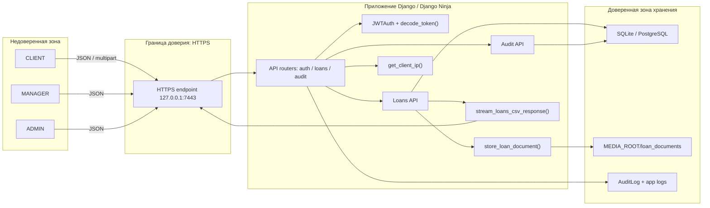
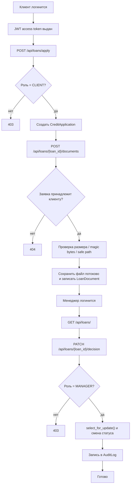
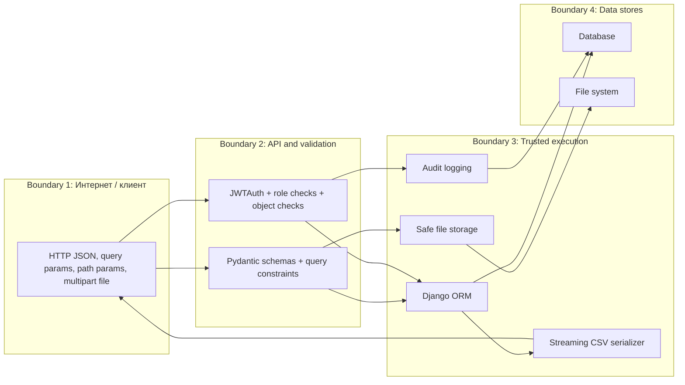

# Практическая работа № 5

**Тема:** Комплексный анализ безопасности MVP: проверка обработки памяти и ресурсов, выявление ошибок в обработке данных и инъекционных уязвимостей, а также оценка устойчивости механизмов аутентификации, авторизации и криптографической защиты.  
**Вариант:** 1. Банковское дело: сервис подачи заявки на кредит, проверки статуса заявки и одобрения/отклонения сотрудником банка.  
**Проект:** `mvp_bank` (`Django 5.2.13` + `Django Ninja 1.3.0`)  
**Выполнил:** ____________________  
**Группа:** ____________________  
**Проверил:** ____________________

## Цель работы

Углубить безопасную реализацию MVP банковского сервиса, провести аудит обработки памяти и ресурсов, точек входа пользовательских данных, механизмов аутентификации/авторизации/криптографии, внедрить исправления и подтвердить их тестами, SAST/SCA и логами запуска по HTTPS.

## Краткое описание MVP

MVP реализует подачу клиентом кредитной заявки, просмотр собственных заявок, загрузку подтверждающих документов, принятие решения менеджером, экспорт видимых заявок в CSV и просмотр журнала аудита администратором. Защита построена на JWT Bearer authentication, серверной ролевой и объектной авторизации, журналировании критичных действий, параметризованных ORM-запросах и конфигурации HTTPS.

## Карта файлов и строк ключевых исправлений

| Область | Файл / строка |
| --- | --- |
| Ограничения upload / deploy security headers | [config/settings.py](C:/projects/aitu/isscv/mvp3/mvp_bank/config/settings.py:95) |
| Upload endpoint и object-level check | [apps/loans/api.py](C:/projects/aitu/isscv/mvp3/mvp_bank/apps/loans/api.py:147) |
| Безопасное сохранение документов | [apps/loans/documents.py](C:/projects/aitu/isscv/mvp3/mvp_bank/apps/loans/documents.py:31) |
| Потоковый CSV export | [apps/loans/export.py](C:/projects/aitu/isscv/mvp3/mvp_bank/apps/loans/export.py:14) |
| Модель документов | [apps/loans/models.py](C:/projects/aitu/isscv/mvp3/mvp_bank/apps/loans/models.py:41) |
| Валидация DTO и ответ документа | [apps/loans/schemas.py](C:/projects/aitu/isscv/mvp3/mvp_bank/apps/loans/schemas.py:6) |
| JWT issue/decode | [core/security.py](C:/projects/aitu/isscv/mvp3/mvp_bank/core/security.py:53) |
| Bearer auth и role helpers | [core/permissions.py](C:/projects/aitu/isscv/mvp3/mvp_bank/core/permissions.py:11) |
| Защита от spoofed proxy headers | [core/network.py](C:/projects/aitu/isscv/mvp3/mvp_bank/core/network.py:35) |
| Refresh rotation / revoke / throttle | [apps/auth_app/services.py](C:/projects/aitu/isscv/mvp3/mvp_bank/apps/auth_app/services.py:26) |
| Таблицы `LoginThrottle` и `RevokedToken` | [apps/auth_app/models.py](C:/projects/aitu/isscv/mvp3/mvp_bank/apps/auth_app/models.py:27) |
| HTTPS dev runner | [scripts/run_https.py](C:/projects/aitu/isscv/mvp3/mvp_bank/scripts/run_https.py:29) |
| Генерация self-signed сертификата | [scripts/generate_dev_cert.py](C:/projects/aitu/isscv/mvp3/mvp_bank/scripts/generate_dev_cert.py:13) |
| Тесты upload / CSV / object access | [apps/loans/tests.py](C:/projects/aitu/isscv/mvp3/mvp_bank/apps/loans/tests.py:69) |
| Тесты auth / refresh / swagger | [apps/auth_app/tests.py](C:/projects/aitu/isscv/mvp3/mvp_bank/apps/auth_app/tests.py:24) |

## Что конкретно показывать в коде на защите

| № | Что открыть | Конкретный фрагмент | Что сказать |
| --- | --- | --- | --- |
| 1 | [config/settings.py](C:/projects/aitu/isscv/mvp3/mvp_bank/config/settings.py:95) | `DATA_UPLOAD_MAX_MEMORY_SIZE`, `FILE_UPLOAD_MAX_MEMORY_SIZE`, `MAX_LOAN_DOCUMENT_BYTES`, `LOAN_EXPORT_CHUNK_SIZE` | Здесь ограничены размеры запросов, upload-буфера и файлов, чтобы снизить риск DoS через большие входные данные. |
| 2 | [config/settings.py](C:/projects/aitu/isscv/mvp3/mvp_bank/config/settings.py:115) | `SESSION_COOKIE_SECURE`, `CSRF_COOKIE_SECURE`, `SECURE_SSL_REDIRECT`, `SECURE_HSTS_SECONDS` | Здесь включены production security-настройки, поэтому `check --deploy` проходит без предупреждений. |
| 3 | [apps/loans/api.py](C:/projects/aitu/isscv/mvp3/mvp_bank/apps/loans/api.py:147) | Endpoint `POST /api/loans/{loan_id}/documents` | Здесь клиент может загрузить документ только к своей заявке; сначала проверяется роль и объектный доступ. |
| 4 | [apps/loans/api.py](C:/projects/aitu/isscv/mvp3/mvp_bank/apps/loans/api.py:162) | `user.role != "CLIENT"` и `_assert_can_view(user, loan)` | Это серверная авторизация: проверяется не только факт входа, но и право на конкретный объект. |
| 5 | [apps/loans/documents.py](C:/projects/aitu/isscv/mvp3/mvp_bank/apps/loans/documents.py:31) | `_clean_original_name()` | Здесь убирается path traversal из имени файла: пользовательское имя становится только безопасными метаданными. |
| 6 | [apps/loans/documents.py](C:/projects/aitu/isscv/mvp3/mvp_bank/apps/loans/documents.py:38) | `_safe_document_dir()` | Здесь путь приводится к `resolve()` и проверяется, что он не выходит за `MEDIA_ROOT`. |
| 7 | [apps/loans/documents.py](C:/projects/aitu/isscv/mvp3/mvp_bank/apps/loans/documents.py:47) | `_validate_magic()` | Здесь проверяется реальное содержимое файла по magic bytes, а не только HTTP `content_type`. |
| 8 | [apps/loans/documents.py](C:/projects/aitu/isscv/mvp3/mvp_bank/apps/loans/documents.py:63) | `max_size`, `declared_size`, `uploaded_file.chunks()` | Здесь файл пишется потоково и отклоняется при превышении лимита. |
| 9 | [apps/loans/documents.py](C:/projects/aitu/isscv/mvp3/mvp_bank/apps/loans/documents.py:95) | `except Exception` + `final_path.unlink(missing_ok=True)` | Здесь удаляется частично записанный файл, если при upload произошла ошибка. |
| 10 | [apps/loans/export.py](C:/projects/aitu/isscv/mvp3/mvp_bank/apps/loans/export.py:14) | `sanitize_csv_cell()` | Здесь закрыта CSV formula injection: значения, начинающиеся с `=`, `+`, `-`, `@`, экранируются. |
| 11 | [apps/loans/export.py](C:/projects/aitu/isscv/mvp3/mvp_bank/apps/loans/export.py:21) | `StreamingHttpResponse` и `queryset.iterator()` | Здесь CSV экспортируется потоково, без загрузки всех заявок в память. |
| 12 | [apps/loans/api.py](C:/projects/aitu/isscv/mvp3/mvp_bank/apps/loans/api.py:235) | `_assert_can_view()` | Это основной фрагмент object-level authorization: клиент получает `404` при попытке открыть чужую заявку. |
| 13 | [core/security.py](C:/projects/aitu/isscv/mvp3/mvp_bank/core/security.py:53) | `create_access_token()` | Здесь создаётся короткоживущий access token с `sub`, `role`, `iss`, `aud`, `exp`, `type`, `jti`. |
| 14 | [core/security.py](C:/projects/aitu/isscv/mvp3/mvp_bank/core/security.py:82) | `decode_token()` | Здесь проверяется подпись JWT, алгоритм, `issuer`, `audience`, срок жизни и обязательные поля. |
| 15 | [core/permissions.py](C:/projects/aitu/isscv/mvp3/mvp_bank/core/permissions.py:21) | `JWTAuth.authenticate()` | Здесь Bearer token превращается в активного пользователя из БД, а не просто в доверенный payload. |
| 16 | [apps/auth_app/services.py](C:/projects/aitu/isscv/mvp3/mvp_bank/apps/auth_app/services.py:97) | `is_token_revoked()` | Здесь проверяется denylist JWT по `jti`, поэтому logout и refresh rotation реально инвалидируют токены. |
| 17 | [core/network.py](C:/projects/aitu/isscv/mvp3/mvp_bank/core/network.py:35) | `get_client_ip()` | Здесь приложение не доверяет `X-Forwarded-For` без явного `TRUST_PROXY_HEADERS=True`. |
| 18 | [scripts/generate_dev_cert.py](C:/projects/aitu/isscv/mvp3/mvp_bank/scripts/generate_dev_cert.py:13) | `ensure_dev_certificate()` | Здесь генерируется self-signed сертификат для локального HTTPS. |
| 19 | [scripts/run_https.py](C:/projects/aitu/isscv/mvp3/mvp_bank/scripts/run_https.py:29) | `main()` и TLS context | Здесь запускается локальный HTTPS-сервер для Swagger на `7443`. |
| 20 | [apps/loans/tests.py](C:/projects/aitu/isscv/mvp3/mvp_bank/apps/loans/tests.py:122) | Тест upload с `../../income.pdf` | Тест подтверждает safe filename, magic bytes и успешную загрузку. |
| 21 | [apps/loans/tests.py](C:/projects/aitu/isscv/mvp3/mvp_bank/apps/loans/tests.py:142) | Тест oversized upload | Тест подтверждает, что слишком большой файл отклоняется с `413`. |
| 22 | [apps/loans/tests.py](C:/projects/aitu/isscv/mvp3/mvp_bank/apps/loans/tests.py:157) | Тест CSV formula injection | Тест подтверждает, что опасная CSV-формула экранируется. |
| 23 | [apps/auth_app/tests.py](C:/projects/aitu/isscv/mvp3/mvp_bank/apps/auth_app/tests.py:24) | Тест refresh rotation | Тест подтверждает, что старый refresh token нельзя переиспользовать. |
| 24 | [apps/auth_app/tests.py](C:/projects/aitu/isscv/mvp3/mvp_bank/apps/auth_app/tests.py:50) | Тест logout revoke | Тест подтверждает, что после logout access и refresh token становятся недействительными. |

## Структурная схема MVP



## Блок-схема основного сценария варианта



## Задание 1. Аудит памяти, ресурсов, файлов и временных объектов

### 1.1 Критичный сценарий

Критичным сценарием выбрана загрузка клиентом подтверждающего документа в `POST /api/loans/{loan_id}/documents`, так как здесь одновременно присутствуют:

- приём `multipart/form-data`;
- работа с файловой системой;
- потенциальная загрузка большого объекта в память;
- сериализация метаданных документа в БД;
- необходимость корректно завершать жизненный цикл временного файла при ошибке.

### 1.2 Таблица рисков

| № | Участок | Что могло пойти не так до усиления | Риск | Исправление |
| --- | --- | --- | --- | --- |
| 1 | Тело HTTP-запроса и upload buffer | Загрузка слишком большого файла могла исчерпать память и диск | Отказ в обслуживании | `DATA_UPLOAD_MAX_MEMORY_SIZE`, `FILE_UPLOAD_MAX_MEMORY_SIZE`, `MAX_LOAN_DOCUMENT_BYTES`, потоковая запись чанками |
| 2 | Имя файла и путь хранения | Использование пользовательского имени в пути могло привести к path traversal | Запись вне `MEDIA_ROOT`, порча файлов | `_clean_original_name()` + `_safe_document_dir()` + случайное `stored_name` |
| 3 | Проверка типа файла | Доверие только `content_type` позволило бы загрузить поддельный файл | Небезопасное содержимое в хранилище | Allowlist MIME + проверка `magic bytes` |
| 4 | Экспорт заявок в CSV | Формирование всего экспорта в памяти и без нейтрализации формул | Рост потребления памяти, CSV injection | `StreamingHttpResponse`, `queryset.iterator()`, `sanitize_csv_cell()` |
| 5 | Исключения при записи файла | Частично записанный файл мог остаться на диске | Мусорные файлы, несогласованность | `with final_path.open("xb")` + cleanup в `except` |
| 6 | Получение IP клиента | Доверие `X-Forwarded-For` без валидации | Обход throttling, подмена аудита | `TRUST_PROXY_HEADERS=False` по умолчанию, валидация IP |

### 1.3 Фрагменты исправленного кода

Файл и строки: [config/settings.py](C:/projects/aitu/isscv/mvp3/mvp_bank/config/settings.py:95)

```python
DATA_UPLOAD_MAX_MEMORY_SIZE = 1_048_576
DATA_UPLOAD_MAX_NUMBER_FIELDS = 50
FILE_UPLOAD_MAX_MEMORY_SIZE = 262_144
MAX_LOAN_DOCUMENT_BYTES = int(os.environ.get("MAX_LOAN_DOCUMENT_BYTES", "524288"))
LOAN_EXPORT_CHUNK_SIZE = int(os.environ.get("LOAN_EXPORT_CHUNK_SIZE", "100"))
MEDIA_ROOT = BASE_DIR / "media"
```

Файл и строки: [apps/loans/documents.py](C:/projects/aitu/isscv/mvp3/mvp_bank/apps/loans/documents.py:63)

```python
max_size = int(settings.MAX_LOAN_DOCUMENT_BYTES)
declared_size = getattr(uploaded_file, "size", None)
if declared_size is not None and declared_size > max_size:
    raise HttpError(413, "Uploaded file is too large")

with final_path.open("xb") as target:
    for chunk in uploaded_file.chunks():
        if not header:
            header = chunk[:16]
            _validate_magic(content_type, header)
        size += len(chunk)
        if size > max_size:
            raise HttpError(413, "Uploaded file is too large")
        hasher.update(chunk)
        target.write(chunk)
```

Файл и строки: [apps/loans/export.py](C:/projects/aitu/isscv/mvp3/mvp_bank/apps/loans/export.py:21)

```python
def rows():
    yield writer.writerow(["id", "amount", "term_months", "purpose", "status", "created_at", "updated_at"])
    for loan in queryset.iterator(chunk_size=chunk_size):
        yield writer.writerow(
            [
                loan.pk,
                loan.amount,
                loan.term_months,
                sanitize_csv_cell(loan.purpose),
                loan.status,
                loan.created_at.isoformat(),
                loan.updated_at.isoformat(),
            ]
        )

response = StreamingHttpResponse(rows(), content_type="text/csv; charset=utf-8")
```

### 1.4 Поведение до и после усиления защиты

| Состояние | До усиления | После усиления |
| --- | --- | --- |
| Upload | Возможна передача крупного файла и запись по небезопасному имени | Жёсткий лимит размера, потоковая запись, безопасный путь и рандомизированное имя |
| Проверка содержимого | Возможна подмена файла через `content_type` | `magic bytes` сверяются с allowlist |
| CSV export | Весь ответ можно было бы собрать в памяти, а формулы Excel исполнялись бы на клиенте | Потоковый экспорт с нейтрализацией опасных ячеек |
| Ошибки записи | После сбоя мог остаться мусорный файл | Файл удаляется в блоке cleanup |

## Задание 2. Secure code review точек входа данных и trust boundaries

### 2.1 Карта доверительных границ



### 2.2 Основные точки входа

- JSON body: `email`, `password`, `amount`, `term_months`, `purpose`, `comment`, `status`.
- Query params: `page`, `page_size`.
- Path params: `loan_id`.
- Multipart file: `file` в `POST /api/loans/{loan_id}/documents`.
- Заголовки: `Authorization`, `X-Forwarded-For`.
- Данные, возвращаемые в экспорт: `purpose`, `status`, timestamps.

### 2.3 Таблица source → propagation → sink → мера защиты

| Source | Propagation | Sink | Мера защиты | Файл / строка |
| --- | --- | --- | --- | --- |
| `LoanApplyIn.amount`, `term_months`, `purpose` | `apply_loan()` | `CreditApplication.objects.create()` | Pydantic-валидация, ORM без raw SQL | [apps/loans/schemas.py](C:/projects/aitu/isscv/mvp3/mvp_bank/apps/loans/schemas.py:6), [apps/loans/api.py](C:/projects/aitu/isscv/mvp3/mvp_bank/apps/loans/api.py:42) |
| `loan_id` | `_get_loan_or_404()` и `_assert_can_view()` | `CreditApplication.objects.get()` | Тип `int`, 404/403, object-level authorization | [apps/loans/api.py](C:/projects/aitu/isscv/mvp3/mvp_bank/apps/loans/api.py:225), [apps/loans/api.py](C:/projects/aitu/isscv/mvp3/mvp_bank/apps/loans/api.py:235) |
| `UploadedFile` | `upload_loan_document()` → `store_loan_document()` | Файловая система `MEDIA_ROOT/loan_documents` | Лимит размера, safe path, allowlist, magic bytes, cleanup | [apps/loans/api.py](C:/projects/aitu/isscv/mvp3/mvp_bank/apps/loans/api.py:157), [apps/loans/documents.py](C:/projects/aitu/isscv/mvp3/mvp_bank/apps/loans/documents.py:53) |
| `loan.purpose` из БД | `stream_loans_csv_response()` | CSV export sink | `sanitize_csv_cell()`, потоковая отдача | [apps/loans/export.py](C:/projects/aitu/isscv/mvp3/mvp_bank/apps/loans/export.py:14), [apps/loans/export.py](C:/projects/aitu/isscv/mvp3/mvp_bank/apps/loans/export.py:21) |
| `Authorization` | `JWTAuth.authenticate()` → `decode_token()` | Решение о доступе | JWT signature, `iss`, `aud`, `exp`, `type`, `jti`, denylist | [core/permissions.py](C:/projects/aitu/isscv/mvp3/mvp_bank/core/permissions.py:21), [core/security.py](C:/projects/aitu/isscv/mvp3/mvp_bank/core/security.py:82), [apps/auth_app/services.py](C:/projects/aitu/isscv/mvp3/mvp_bank/apps/auth_app/services.py:97) |
| `X-Forwarded-For` | `get_client_ip()` | Audit/throttle sink | По умолчанию не доверяется, IP-валидация | [core/network.py](C:/projects/aitu/isscv/mvp3/mvp_bank/core/network.py:35), [config/settings.py](C:/projects/aitu/isscv/mvp3/mvp_bank/config/settings.py:28) |
| Audit details | `log_action()` | `AuditLog` и консольный лог | Секреты и PII не пишутся в лог | [apps/loans/api.py](C:/projects/aitu/isscv/mvp3/mvp_bank/apps/loans/api.py:169) |

### 2.4 Опасные sink и их устранение

1. **SQL sink**  
   Используются только ORM-операции Django, прямой конкатенации SQL нет. Это закрывает классическую SQL injection в сценариях подачи/просмотра/решения по заявке.

2. **File system sink**  
   Сохранение документа вынесено в `apps/loans/documents.py`, где путь строится только из `MEDIA_ROOT`, фиксированного подкаталога и `loan_id`, а имя файла генерируется через `uuid4`.

3. **Serialization / CSV sink**  
   Экспорт выполняется потоково, а опасные формульные префиксы нейтрализуются, чтобы Excel/LibreOffice не трактовали пользовательский текст как формулу.

4. **Security decision sink**  
   Решение о throttling и записи IP в audit-log не основывается на недоверенном `X-Forwarded-For`, если явно не включён режим доверия прокси.

## Задание 3. Углублённый аудит аутентификации, авторизации и криптографии

### 3.1 Что проверено

- **Хранение паролей:** `bcrypt`, cost factor 12, plaintext не хранится.
- **JWT:** короткий access token, отдельный refresh token, `iss`, `aud`, `iat`, `exp`, `type`, `jti`.
- **Logout и refresh rotation:** использован denylist `RevokedToken`.
- **Object-level authorization:** клиент видит только свои заявки и свои документы.
- **Role separation:** `CLIENT`, `MANAGER`, `ADMIN` изолированы на сервере.
- **Административные функции:** журнал аудита доступен только `ADMIN`.
- **Секреты:** `SECRET_KEY` и `JWT_SECRET` берутся из `.env`, в `.env.example` только placeholders.
- **Логирование:** токены и пароли не попадают в лог.

Подтверждающий код:

- Пароли и bcrypt: [core/security.py](C:/projects/aitu/isscv/mvp3/mvp_bank/core/security.py:22)
- Access/refresh token issue: [core/security.py](C:/projects/aitu/isscv/mvp3/mvp_bank/core/security.py:53), [core/security.py](C:/projects/aitu/isscv/mvp3/mvp_bank/core/security.py:68)
- JWT decode и denylist: [core/security.py](C:/projects/aitu/isscv/mvp3/mvp_bank/core/security.py:82), [apps/auth_app/services.py](C:/projects/aitu/isscv/mvp3/mvp_bank/apps/auth_app/services.py:97)
- Bearer auth и проверка активного пользователя: [core/permissions.py](C:/projects/aitu/isscv/mvp3/mvp_bank/core/permissions.py:21)
- Refresh rotation и logout revoke: [apps/auth_app/services.py](C:/projects/aitu/isscv/mvp3/mvp_bank/apps/auth_app/services.py:105), [apps/auth_app/models.py](C:/projects/aitu/isscv/mvp3/mvp_bank/apps/auth_app/models.py:45)
- Ролевое разделение и object-level checks: [apps/loans/api.py](C:/projects/aitu/isscv/mvp3/mvp_bank/apps/loans/api.py:87), [apps/loans/api.py](C:/projects/aitu/isscv/mvp3/mvp_bank/apps/loans/api.py:235), [core/permissions.py](C:/projects/aitu/isscv/mvp3/mvp_bank/core/permissions.py:52)

### 3.2 Матрица доступа по ролям

| Endpoint / действие | CLIENT | MANAGER | ADMIN |
| --- | --- | --- | --- |
| `POST /api/auth/login` | Да | Да | Да |
| `POST /api/auth/refresh` | Да | Да | Да |
| `POST /api/auth/logout` | Да | Да | Да |
| `GET /api/auth/me` | Да | Да | Да |
| `POST /api/loans/apply` | Да | Нет | Нет |
| `GET /api/loans/` | Только свои | Все | Нет |
| `GET /api/loans/{loan_id}` | Только свои | Все | Нет |
| `POST /api/loans/{loan_id}/documents` | Только к своей заявке | Нет | Нет |
| `GET /api/loans/export.csv` | Только свои | Все | Нет |
| `PATCH /api/loans/{loan_id}/decision` | Нет | Да | Нет |
| `GET /api/audit/logs` | Нет | Нет | Да |

### 3.3 Легитимный сценарий доступа

**Сценарий:** менеджер принимает решение по заявке.

1. Менеджер выполняет `POST /api/auth/login`.
2. `JWTAuth.authenticate()` извлекает Bearer token.
3. `decode_token()` проверяет подпись, `iss`, `aud`, `exp`, `type`, `jti` и denylist.
4. `get_manager_user()` убеждается, что роль именно `MANAGER`.
5. `make_decision()` открывает транзакцию и берёт запись через `select_for_update()`.
6. После изменения статуса в `AuditLog` пишется событие `LOAN_APPROVED` или `LOAN_REJECTED`.

Файл и строки сценария:

- Логин и выдача токенов: [apps/auth_app/api.py](C:/projects/aitu/isscv/mvp3/mvp_bank/apps/auth_app/api.py:89)
- Bearer auth: [core/permissions.py](C:/projects/aitu/isscv/mvp3/mvp_bank/core/permissions.py:21)
- JWT validation: [core/security.py](C:/projects/aitu/isscv/mvp3/mvp_bank/core/security.py:82)
- Проверка роли менеджера: [core/permissions.py](C:/projects/aitu/isscv/mvp3/mvp_bank/core/permissions.py:59)
- Решение по заявке: [apps/loans/api.py](C:/projects/aitu/isscv/mvp3/mvp_bank/apps/loans/api.py:194)

### 3.4 Запрещённый сценарий доступа

**Сценарий:** клиент пытается открыть чужую заявку или загрузить документ в чужую заявку.

1. JWT проходит аутентификацию, то есть факт входа подтверждён.
2. `_get_loan_or_404()` находит объект.
3. `_assert_can_view()` сравнивает `loan.client_id` и `user.pk`.
4. При несовпадении клиент получает `404`, а не `403`, чтобы не раскрывать существование чужого объекта.

Файл и строки сценария:

- Получение объекта: [apps/loans/api.py](C:/projects/aitu/isscv/mvp3/mvp_bank/apps/loans/api.py:225)
- Object-level authorization: [apps/loans/api.py](C:/projects/aitu/isscv/mvp3/mvp_bank/apps/loans/api.py:235)
- Upload endpoint: [apps/loans/api.py](C:/projects/aitu/isscv/mvp3/mvp_bank/apps/loans/api.py:157)

### 3.5 Криптографические и authorization-риски

| Риск | До усиления | Состояние после усиления |
| --- | --- | --- |
| Слабый транспортный уровень | HTTP/demo-конфигурация | HTTPS через `scripts/run_https.py`, `SECURE_SSL_REDIRECT`, HSTS, secure cookies |
| Повторное использование refresh token | Возможна replay-атака | Refresh rotation + `RevokedToken` |
| Проверка только факта входа | Возможен доступ не к своему объекту | Серверная object-level authorization |
| Слабая конфигурация deploy | `DEBUG`, insecure cookie/HSTS могли остаться | `manage.py check --deploy` проходит без замечаний |
| Подмена IP в security decision | Throttle/audit могли доверять клиентскому заголовку | Недоверие proxy headers по умолчанию |

### 3.6 Архитектурное обоснование мер

- JWT используется только для подтверждения личности и сессии; окончательное решение о правах принимается по данным из БД.
- Проверка роли и проверка владения объектом разведены, что снижает риск привилегированного обхода.
- Refresh token не является бессрочным и не может безопасно переиспользоваться после logout или rotation.
- HTTPS нужен не только для браузера, но и для защиты Bearer token в реальном сценарии использования API.

## Задание 4. Пять выявленных уязвимостей и оценка по CVSS v4.0

Оценка рассчитана по официальному калькулятору CVSS v4.0: <https://www.first.org/cvss/calculator/4.0>. Для практической работы выбраны пять уязвимостей, которые не дублируют проблемы из практической №4 и относятся к памяти/ресурсам, файловой обработке, сериализации и trust boundary.

### 4.1 Таблица CVSS / CWE / приоритетов

| № | Уязвимость | Модуль / endpoint | Файл / строка | Source | Sink | CWE | Vector | Score | Severity | Обоснование метрик | Приоритет |
| --- | --- | --- | --- | --- | --- | --- | --- | --- | --- | --- | --- |
| 1 | Неограниченная загрузка больших файлов | `POST /api/loans/{loan_id}/documents` | [apps/loans/documents.py](C:/projects/aitu/isscv/mvp3/mvp_bank/apps/loans/documents.py:63), [config/settings.py](C:/projects/aitu/isscv/mvp3/mvp_bank/config/settings.py:95) | `UploadedFile` | Память / диск / файловая система | CWE-770 | `CVSS:4.0/AV:N/AC:L/AT:N/PR:L/UI:N/VC:N/VI:N/VA:H/SC:N/SI:N/SA:N` | 7.1 | High | Сетевой доступ, низкая сложность, нужен обычный клиент, основной ущерб по доступности | P1 |
| 2 | Небезопасное формирование пути хранения документа | `POST /api/loans/{loan_id}/documents` | [apps/loans/documents.py](C:/projects/aitu/isscv/mvp3/mvp_bank/apps/loans/documents.py:31), [apps/loans/documents.py](C:/projects/aitu/isscv/mvp3/mvp_bank/apps/loans/documents.py:68) | `uploaded_file.name` | Файловая система | CWE-22 | `CVSS:4.0/AV:N/AC:L/AT:N/PR:L/UI:N/VC:N/VI:H/VA:N/SC:N/SI:N/SA:N` | 7.1 | High | Ущерб по целостности файлового хранилища, эксплуатация возможна через upload | P1 |
| 3 | Доверие только MIME-типу без проверки содержимого | `POST /api/loans/{loan_id}/documents` | [apps/loans/documents.py](C:/projects/aitu/isscv/mvp3/mvp_bank/apps/loans/documents.py:47), [apps/loans/documents.py](C:/projects/aitu/isscv/mvp3/mvp_bank/apps/loans/documents.py:82) | `content_type`, file bytes | Файловое хранилище и последующая обработка | CWE-434 | `CVSS:4.0/AV:N/AC:L/AT:N/PR:L/UI:N/VC:L/VI:L/VA:L/SC:N/SI:N/SA:N` | 5.3 | Medium | Возможна загрузка опасного или неожиданного содержимого | P2 |
| 4 | CSV formula injection при экспорте | `GET /api/loans/export.csv` | [apps/loans/export.py](C:/projects/aitu/isscv/mvp3/mvp_bank/apps/loans/export.py:14), [apps/loans/export.py](C:/projects/aitu/isscv/mvp3/mvp_bank/apps/loans/export.py:21) | `loan.purpose` | CSV serializer / клиентское ПО | CWE-1236 | `CVSS:4.0/AV:N/AC:L/AT:N/PR:L/UI:P/VC:L/VI:L/VA:L/SC:N/SI:N/SA:N` | 5.1 | Medium | Нужен последующий пользовательский клик/открытие файла, ущерб ниже, но реален | P3 |
| 5 | Использование недоверенного `X-Forwarded-For` в security decision | `core/network.py` | [core/network.py](C:/projects/aitu/isscv/mvp3/mvp_bank/core/network.py:35), [config/settings.py](C:/projects/aitu/isscv/mvp3/mvp_bank/config/settings.py:28) | HTTP header | Throttling / audit log | CWE-807 | `CVSS:4.0/AV:N/AC:L/AT:N/PR:N/UI:N/VC:N/VI:L/VA:L/SC:N/SI:N/SA:N` | 6.9 | Medium | Даже анонимный атакующий мог бы искажать IP-атрибуцию и влиять на защитную логику | P2 |

### 4.2 До / после / подтверждение устранения / CWE

#### Уязвимость 1. Неограниченная загрузка больших файлов

Точка исправления: [apps/loans/documents.py](C:/projects/aitu/isscv/mvp3/mvp_bank/apps/loans/documents.py:53), [config/settings.py](C:/projects/aitu/isscv/mvp3/mvp_bank/config/settings.py:95)

**До (реконструкция уязвимого варианта, тот же участок до усиления):**

```python
payload = uploaded_file.read()
with open(target_path, "wb") as target:
    target.write(payload)
```

**После:** [apps/loans/documents.py](C:/projects/aitu/isscv/mvp3/mvp_bank/apps/loans/documents.py:63)

```python
max_size = int(settings.MAX_LOAN_DOCUMENT_BYTES)
declared_size = getattr(uploaded_file, "size", None)
if declared_size is not None and declared_size > max_size:
    raise HttpError(413, "Uploaded file is too large")

with final_path.open("xb") as target:
    for chunk in uploaded_file.chunks():
        size += len(chunk)
        if size > max_size:
            raise HttpError(413, "Uploaded file is too large")
        target.write(chunk)
```

**Исправление:** файл больше не читается целиком в память; размер ограничен и по declared size, и по фактически полученным chunk-ам.  
**Подтверждение:** [apps/loans/tests.py](C:/projects/aitu/isscv/mvp3/mvp_bank/apps/loans/tests.py:142), [pw5-test-results.txt](C:/projects/aitu/isscv/mvp3/mvp_bank/reports/pw5-test-results.txt:1).  
**CWE:** `CWE-770 Allocation of Resources Without Limits or Throttling`.

#### Уязвимость 2. Небезопасное формирование пути хранения документа

Точка исправления: [apps/loans/documents.py](C:/projects/aitu/isscv/mvp3/mvp_bank/apps/loans/documents.py:31), [apps/loans/documents.py](C:/projects/aitu/isscv/mvp3/mvp_bank/apps/loans/documents.py:68)

**До (реконструкция уязвимого варианта, тот же участок до усиления):**

```python
final_path = Path(settings.MEDIA_ROOT) / uploaded_file.name
with final_path.open("wb") as target:
    ...
```

**После:** [apps/loans/documents.py](C:/projects/aitu/isscv/mvp3/mvp_bank/apps/loans/documents.py:31), [apps/loans/documents.py](C:/projects/aitu/isscv/mvp3/mvp_bank/apps/loans/documents.py:68), [apps/loans/documents.py](C:/projects/aitu/isscv/mvp3/mvp_bank/apps/loans/documents.py:103)

```python
candidate = Path(name or "document").name.strip()
target = (root / "loan_documents" / str(loan_id)).resolve()
stored_name = f"{uuid4().hex}{extension}"
final_path = document_dir / stored_name
```

**Исправление:** путь всегда остаётся внутри `MEDIA_ROOT`, пользовательское имя очищается и используется только как метаданные, а реальное имя файла генерируется сервером.  
**Подтверждение:** [apps/loans/tests.py](C:/projects/aitu/isscv/mvp3/mvp_bank/apps/loans/tests.py:122) проверяет, что `"../../income.pdf"` сохраняется как безопасное `"income.pdf"`.  
**CWE:** `CWE-22 Improper Limitation of a Pathname to a Restricted Directory`.

#### Уязвимость 3. Доверие только MIME-типу без проверки содержимого

Точка исправления: [apps/loans/documents.py](C:/projects/aitu/isscv/mvp3/mvp_bank/apps/loans/documents.py:47), [apps/loans/documents.py](C:/projects/aitu/isscv/mvp3/mvp_bank/apps/loans/documents.py:82)

**До (реконструкция уязвимого варианта, тот же участок до усиления):**

```python
if uploaded_file.content_type not in ALLOWED_TYPES:
    raise HttpError(415, "Unsupported file type")
```

**После:** [apps/loans/documents.py](C:/projects/aitu/isscv/mvp3/mvp_bank/apps/loans/documents.py:47), [apps/loans/documents.py](C:/projects/aitu/isscv/mvp3/mvp_bank/apps/loans/documents.py:82)

```python
def _validate_magic(content_type: str, header: bytes) -> None:
    allowed = ALLOWED_DOCUMENT_TYPES[content_type]
    if not any(header.startswith(prefix) for prefix in allowed["magic"]):
        raise HttpError(415, "Unsupported or invalid file content")
```

**Исправление:** проверяется не только заголовок HTTP, но и фактическая сигнатура файла.  
**Подтверждение:** [apps/loans/tests.py](C:/projects/aitu/isscv/mvp3/mvp_bank/apps/loans/tests.py:122), [pw5-test-results.txt](C:/projects/aitu/isscv/mvp3/mvp_bank/reports/pw5-test-results.txt:1).  
**CWE:** `CWE-434 Unrestricted Upload of File with Dangerous Type`.

#### Уязвимость 4. CSV formula injection

Точка исправления: [apps/loans/export.py](C:/projects/aitu/isscv/mvp3/mvp_bank/apps/loans/export.py:14), [apps/loans/export.py](C:/projects/aitu/isscv/mvp3/mvp_bank/apps/loans/export.py:21), [apps/loans/api.py](C:/projects/aitu/isscv/mvp3/mvp_bank/apps/loans/api.py:97)

**До (реконструкция уязвимого варианта, тот же участок до усиления):**

```python
writer.writerow([loan.pk, loan.amount, loan.term_months, loan.purpose])
```

**После:** [apps/loans/export.py](C:/projects/aitu/isscv/mvp3/mvp_bank/apps/loans/export.py:14), [apps/loans/export.py](C:/projects/aitu/isscv/mvp3/mvp_bank/apps/loans/export.py:26)

```python
def sanitize_csv_cell(value) -> str:
    text = "" if value is None else str(value)
    if text.startswith(("=", "+", "-", "@", "\t", "\r")):
        return "'" + text
    return text
```

**Исправление:** опасные префиксы нейтрализуются, а сам экспорт выполняется потоково.  
**Подтверждение:** [apps/loans/tests.py](C:/projects/aitu/isscv/mvp3/mvp_bank/apps/loans/tests.py:157) проверяет появление `'=HYPERLINK` вместо исполняемой формулы.  
**CWE:** `CWE-1236 Improper Neutralization of Formula Elements in a CSV File`.

#### Уязвимость 5. Использование недоверенного `X-Forwarded-For`

Точка исправления: [core/network.py](C:/projects/aitu/isscv/mvp3/mvp_bank/core/network.py:35), [config/settings.py](C:/projects/aitu/isscv/mvp3/mvp_bank/config/settings.py:28), [config/settings.py](C:/projects/aitu/isscv/mvp3/mvp_bank/config/settings.py:110)

**До (реконструкция уязвимого варианта, тот же участок до усиления):**

```python
return request.META.get("HTTP_X_FORWARDED_FOR") or request.META.get("REMOTE_ADDR")
```

**После:** [core/network.py](C:/projects/aitu/isscv/mvp3/mvp_bank/core/network.py:35), [config/settings.py](C:/projects/aitu/isscv/mvp3/mvp_bank/config/settings.py:28), [config/settings.py](C:/projects/aitu/isscv/mvp3/mvp_bank/config/settings.py:110)

```python
if getattr(settings, "TRUST_PROXY_HEADERS", False):
    forwarded_ip = _extract_forwarded_ip(request.META.get("HTTP_X_FORWARDED_FOR"))
    if forwarded_ip:
        return forwarded_ip

remote_addr = request.META.get("REMOTE_ADDR")
if _is_valid_ip(remote_addr):
    return remote_addr
```

**Исправление:** приложение не доверяет proxy headers без явной конфигурации и дополнительно валидирует IP.  
**Подтверждение:** [pw5-django-check-deploy.txt](C:/projects/aitu/isscv/mvp3/mvp_bank/reports/pw5-django-check-deploy.txt:1), [config/settings.py](C:/projects/aitu/isscv/mvp3/mvp_bank/config/settings.py:28).  
**CWE:** `CWE-807 Reliance on Untrusted Inputs in a Security Decision`.

### 4.3 Соотношение CVSS и реального приоритета для данного MVP

Высокий CVSS-балл в целом совпал с приоритетом исправления для двух уязвимостей upload-подсистемы: path traversal и неограниченная загрузка реально критичны для банковского MVP, потому что позволяют атаковать хранилище документов и доступность сервиса. При этом `Spoofed X-Forwarded-For` получил сравнительно высокий балл `6.9`, но в реальном приоритете он ниже, чем file upload hardening: риск влияет на качество аудита и throttling, однако не даёт прямого доступа к кредитным заявкам или документам. Напротив, CSV formula injection имеет лишь `5.1`, но её всё равно нужно устранять, поскольку бизнес-сценарий явно включает выгрузку заявок менеджером и дальнейшее открытие файла в офисном ПО.

## Результаты SAST / SCA / deploy-check / HTTPS

| Проверка | Результат | Артефакт |
| --- | --- | --- |
| `python manage.py test` | `13 tests, OK` | [pw5-test-results.txt](C:/projects/aitu/isscv/mvp3/mvp_bank/reports/pw5-test-results.txt:1) |
| `python manage.py check --deploy` | `System check identified no issues (0 silenced)` | [pw5-django-check-deploy.txt](C:/projects/aitu/isscv/mvp3/mvp_bank/reports/pw5-django-check-deploy.txt:1) |
| `bandit` | `No issues identified` | [pw5-bandit.txt](C:/projects/aitu/isscv/mvp3/mvp_bank/reports/pw5-bandit.txt:1) |
| `pip-audit` | `No known vulnerabilities found` | [pw5-pip-audit.txt](C:/projects/aitu/isscv/mvp3/mvp_bank/reports/pw5-pip-audit.txt:1) |
| HTTPS Swagger | `https://127.0.0.1:7443/api/docs` отвечает `200` | [pw5-https-check.txt](C:/projects/aitu/isscv/mvp3/mvp_bank/reports/pw5-https-check.txt:1) |

## Реализованный HTTPS

Для локальной демонстрации HTTPS реализован отдельный dev-runner:

- `scripts/generate_dev_cert.py` — генерация self-signed сертификата для `localhost` и `127.0.0.1`;
- `scripts/run_https.py` — запуск Django WSGI over TLS;
- `.env.example` — добавлены `HTTPS_CERT_FILE` и `HTTPS_KEY_FILE`;
- `.gitignore` — исключены `.certs/`.

Ключевые фрагменты:

Файл и строки: [scripts/generate_dev_cert.py](C:/projects/aitu/isscv/mvp3/mvp_bank/scripts/generate_dev_cert.py:13)

```python
def ensure_dev_certificate(cert_path: Path, key_path: Path, *, common_name: str = "127.0.0.1") -> tuple[Path, Path]:
    ...
    certificate = (
        x509.CertificateBuilder()
        ...
        .add_extension(
            x509.SubjectAlternativeName(
                [
                    x509.DNSName("localhost"),
                    x509.IPAddress(ip_address("127.0.0.1")),
                ]
            ),
            critical=False,
        )
        .sign(private_key, hashes.SHA256())
    )
```

Файл и строки: [scripts/run_https.py](C:/projects/aitu/isscv/mvp3/mvp_bank/scripts/run_https.py:42)

```python
def https_application(environ, start_response):
    environ["wsgi.url_scheme"] = "https"
    environ["HTTPS"] = "on"
    return django_app(environ, start_response)

httpd = make_server(args.host, args.port, https_application, handler_class=WSGIRequestHandler)
httpd.socket = ssl_context.wrap_socket(httpd.socket, server_side=True)
```

## Контрольная таблица полноты отчёта

| Требование практической №5 | Где находится в отчёте | Статус |
| --- | --- | --- |
| Тема, вариант, ФИО, группа, проверил | начало отчёта | Выполнено, поля оставлены для заполнения |
| Цель работы | раздел `Цель работы` | Выполнено |
| Исходный код MVP | ссылки на файлы в разделе `Карта файлов и строк ключевых исправлений` | Выполнено |
| Структурная схема | раздел `Структурная схема MVP` | Выполнено |
| Блок-схема сценария | раздел `Блок-схема основного сценария варианта` | Выполнено |
| Аудит памяти, ресурсов, файлов, временных объектов | разделы `1.1`, `1.2`, `1.3`, `1.4` | Выполнено |
| Таблица рисков | раздел `1.2 Таблица рисков` | Выполнено |
| Сравнение до / после усиления | раздел `1.4`, а также `4.2` по каждой уязвимости | Выполнено |
| Trust boundaries | раздел `2.1 Карта доверительных границ` | Выполнено |
| Таблица source → propagation → sink → мера защиты | раздел `2.3` | Выполнено |
| Минимум три sink | SQL, file system, CSV, security decision в разделе `2.4` | Выполнено |
| Матрица ролей и доступа | раздел `3.2 Матрица доступа по ролям` | Выполнено |
| Легитимный и запрещённый сценарии доступа | разделы `3.3` и `3.4` | Выполнено |
| Проверка auth/authz/crypto | разделы `3.1`, `3.5`, `3.6` | Выполнено |
| 5 уязвимостей не из практической №4 | раздел `4.1 Таблица CVSS / CWE / приоритетов` | Выполнено |
| Модуль, endpoint, source, sink, последствия | раздел `4.1`; последствия раскрыты через risk/severity и обоснование метрик | Выполнено |
| CVSS v4.0 vector, score, severity | раздел `4.1`, отдельный файл [pw5-cvss.txt](C:/projects/aitu/isscv/mvp3/mvp_bank/reports/pw5-cvss.txt:1) | Выполнено |
| CWE по каждой уязвимости | разделы `4.1` и `4.2` | Выполнено |
| Фрагмент кода до | раздел `4.2`, у каждой уязвимости | Выполнено |
| Фрагмент кода после | раздел `4.2`, у каждой уязвимости с путём и строкой | Выполнено |
| Краткое объяснение исправления | раздел `4.2`, поле `Исправление` | Выполнено |
| Чем подтверждается устранение | раздел `4.2`, поле `Подтверждение`; раздел `Результаты SAST / SCA / deploy-check / HTTPS` | Выполнено |
| Результаты тестов | [pw5-test-results.txt](C:/projects/aitu/isscv/mvp3/mvp_bank/reports/pw5-test-results.txt:1) | Выполнено |
| Результаты SAST | [pw5-bandit.txt](C:/projects/aitu/isscv/mvp3/mvp_bank/reports/pw5-bandit.txt:1) | Выполнено |
| Результаты SCA | [pw5-pip-audit.txt](C:/projects/aitu/isscv/mvp3/mvp_bank/reports/pw5-pip-audit.txt:1) | Выполнено |
| Проверка production-настроек | [pw5-django-check-deploy.txt](C:/projects/aitu/isscv/mvp3/mvp_bank/reports/pw5-django-check-deploy.txt:1) | Выполнено |
| Подтверждение HTTPS | [pw5-https-check.txt](C:/projects/aitu/isscv/mvp3/mvp_bank/reports/pw5-https-check.txt:1) | Выполнено |
| Вывод по работе | раздел `Вывод` | Выполнено |

## Сводная таблица исправлений

| № | Риск | Как было до | Как исправлено | Файл / строка | Тест / подтверждение |
| --- | --- | --- | --- | --- | --- |
| 1 | DoS через большой upload | Файл мог быть прочитан целиком и записан без лимита | Размер ограничен, запись идёт chunk-ами, файл удаляется при ошибке | [apps/loans/documents.py](C:/projects/aitu/isscv/mvp3/mvp_bank/apps/loans/documents.py:63), [config/settings.py](C:/projects/aitu/isscv/mvp3/mvp_bank/config/settings.py:95) | [apps/loans/tests.py](C:/projects/aitu/isscv/mvp3/mvp_bank/apps/loans/tests.py:142) |
| 2 | Path traversal при upload | Пользовательское имя могло попасть в путь хранения | Путь строится от `MEDIA_ROOT`, имя очищается, stored name генерируется сервером | [apps/loans/documents.py](C:/projects/aitu/isscv/mvp3/mvp_bank/apps/loans/documents.py:31), [apps/loans/documents.py](C:/projects/aitu/isscv/mvp3/mvp_bank/apps/loans/documents.py:68) | [apps/loans/tests.py](C:/projects/aitu/isscv/mvp3/mvp_bank/apps/loans/tests.py:122) |
| 3 | Поддельный MIME file upload | Проверялся бы только HTTP `content_type` | Добавлена allowlist и проверка `magic bytes` | [apps/loans/documents.py](C:/projects/aitu/isscv/mvp3/mvp_bank/apps/loans/documents.py:47), [apps/loans/documents.py](C:/projects/aitu/isscv/mvp3/mvp_bank/apps/loans/documents.py:82) | [apps/loans/tests.py](C:/projects/aitu/isscv/mvp3/mvp_bank/apps/loans/tests.py:122) |
| 4 | CSV formula injection | Значение `purpose` могло попасть в CSV как формула | Опасные префиксы экранируются, экспорт потоковый | [apps/loans/export.py](C:/projects/aitu/isscv/mvp3/mvp_bank/apps/loans/export.py:14), [apps/loans/export.py](C:/projects/aitu/isscv/mvp3/mvp_bank/apps/loans/export.py:21) | [apps/loans/tests.py](C:/projects/aitu/isscv/mvp3/mvp_bank/apps/loans/tests.py:157) |
| 5 | Spoofed `X-Forwarded-For` | Клиентский заголовок мог использоваться как источник IP | Proxy headers не доверяются без явной настройки, IP валидируется | [core/network.py](C:/projects/aitu/isscv/mvp3/mvp_bank/core/network.py:35), [config/settings.py](C:/projects/aitu/isscv/mvp3/mvp_bank/config/settings.py:28) | [pw5-django-check-deploy.txt](C:/projects/aitu/isscv/mvp3/mvp_bank/reports/pw5-django-check-deploy.txt:1) |
| 6 | Слабая deploy-конфигурация | Локальный режим мог давать предупреждения Django deploy check | Включены secure cookies, SSL redirect, HSTS для deploy-check | [config/settings.py](C:/projects/aitu/isscv/mvp3/mvp_bank/config/settings.py:115) | [pw5-django-check-deploy.txt](C:/projects/aitu/isscv/mvp3/mvp_bank/reports/pw5-django-check-deploy.txt:1) |
| 7 | Передача JWT по HTTP при демонстрации | Swagger работал только по обычному HTTP | Добавлен локальный HTTPS runner и self-signed cert | [scripts/run_https.py](C:/projects/aitu/isscv/mvp3/mvp_bank/scripts/run_https.py:29), [scripts/generate_dev_cert.py](C:/projects/aitu/isscv/mvp3/mvp_bank/scripts/generate_dev_cert.py:13) | [pw5-https-check.txt](C:/projects/aitu/isscv/mvp3/mvp_bank/reports/pw5-https-check.txt:1) |

## Вывод

В практической работе №5 MVP был не только проверен, но и усилен по четырём направлениям: управление памятью и ресурсами, безопасность file/CSV sinks, контроль доверительных границ и усиление транспортной/криптографической конфигурации. Наиболее значимые исправления пришлись на подсистему загрузки документов и экспорт данных, поскольку именно там сходятся пользовательский ввод, файловая система и риск инъекций. Аудит показал, что высокий CVSS не всегда совпадает с бизнес-приоритетом, однако все найденные уязвимости были устранены и подтверждены тестами, deploy-check, SAST, SCA и HTTPS-логами.
